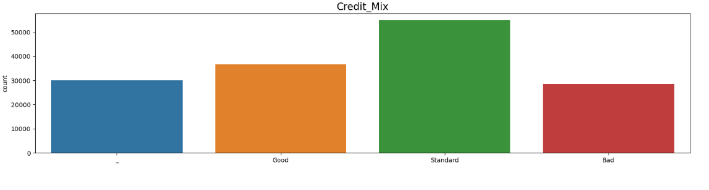
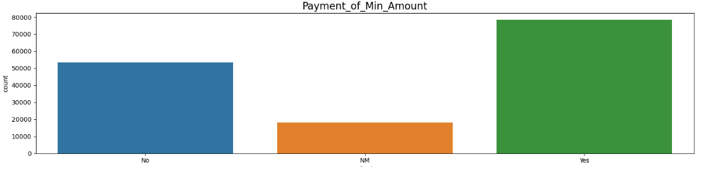
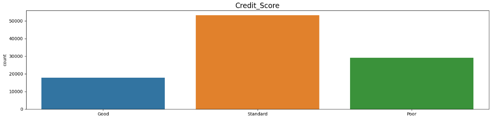
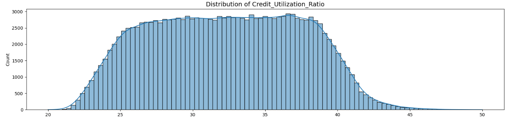
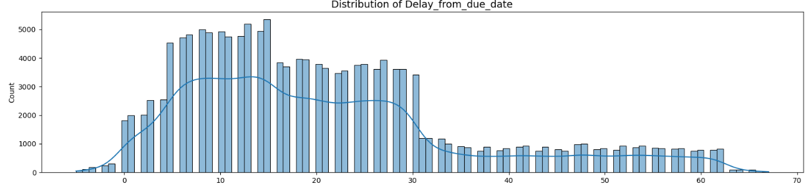
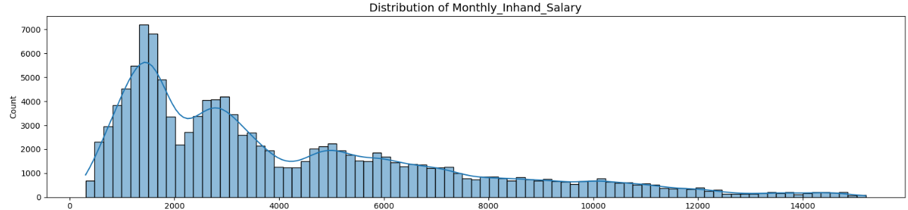
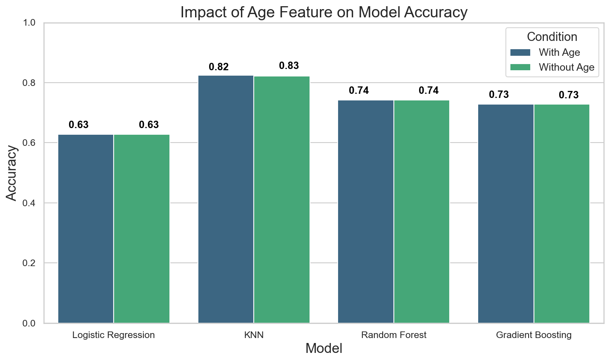

# CreditScoring

This notebook contains a data analysis and credit scoring model using machine learning techniques. The goal of the project is to predict a borrower's credit scoring based on various financial indicators, and to investigate how much a borrower's age affects their ability to obtain a new loan.

## Visualizations

Here are some visualizations related to the credit scoring project:

| Visualization 1 | Visualization 2 | Visualization 3 |
|:---------------:|:---------------:|:---------------:|
|  |  |  |
| visualization1.png | visualization2.png | visualization3.png |

| Visualization 4 | Visualization 5 | Visualization 6 |
|:---------------:|:---------------:|:---------------:|
|  |  |  |
| visualization4.png | visualization5.png | visualization6.png |

## Results
Below is an example of the result obtained from the credit scoring model:



## Installation and Usage

1. **Clone the repository**:
    ```bash
    git clone https://github.com/username/repo.git
    ```

2. **Install the required dependencies**:
    ```bash
    pip install -r requirements.txt
    ```

3. **Run Jupyter Notebook**:
    ```bash
    jupyter notebook
    ```
   Open the file `credit_scoring.ipynb`.
